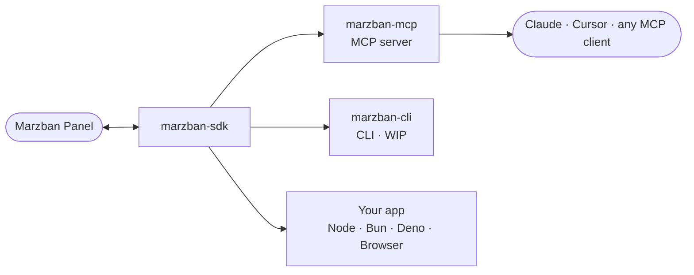

# MarzbanSDK

**A TypeScript toolkit for the [Marzban](https://github.com/Gozargah/Marzban) API.**

[**Documentation**](https://ilmar7786.github.io/marzban-sdk) · [**SDK**](./packages/sdk) · [**MCP Server**](./packages/mcp)

---

One typed API client for Marzban, and everything built on top of it. Fix a
bug or add an endpoint in the SDK, and the MCP server, the CLI, and every app
built on it get it for free.

## How it fits together

The SDK talks to your Marzban panel. The MCP server and CLI are just clients
of that same SDK — same auth, same retries, same typed errors — so they never
drift from each other or from your own code.

## Packages

| Package                          | npm                                                        | Docker                                                                    | What it is                                                            |
| -------------------------------- | ---------------------------------------------------------- | ------------------------------------------------------------------------- | --------------------------------------------------------------------- |
| [`packages/sdk`](./packages/sdk) | [`marzban-sdk`](https://www.npmjs.com/package/marzban-sdk) | —                                                                         | The typed API client — auth, retries, WebSocket log streams, webhooks |
| [`packages/mcp`](./packages/mcp) | [`marzban-mcp`](https://www.npmjs.com/package/marzban-mcp) | [`ilmar7786/marzban-mcp`](https://hub.docker.com/r/ilmar7786/marzban-mcp) | An MCP server exposing Marzban operations as tools for AI agents      |
| [`packages/cli`](./packages/cli) | —                                                          | —                                                                         | A CLI on top of the SDK — WIP, unpublished                            |
| [`apps/docs`](./apps/docs)       | —                                                          | —                                                                         | The documentation site                                                |

Each publishable package has its own version, `README.md`, changelog and
release tags (`sdk-v*`, `mcp-v*`, `cli-v*`).

## Documentation

Full guides, configuration reference and the complete typed API live at
**[ilmar7786.github.io/marzban-sdk](https://ilmar7786.github.io/marzban-sdk)**.

For how the repository itself is built — architecture, conventions, testing,
CI and releases — see **[`docs/`](./docs/README.md)**.

## Contributing

Contributions are welcome — see [CONTRIBUTING.md](./CONTRIBUTING.md) for how to
submit a patch. Found a bug or have an idea?
[Open an issue](https://github.com/Ilmar7786/marzban-sdk/issues).

## License

[MIT](./LICENSE) © [ilmar7786](https://github.com/Ilmar7786)

If this project saves you time, consider giving it a ⭐ on <a href="https://github.com/Ilmar7786/marzban-sdk">GitHub</a>.

