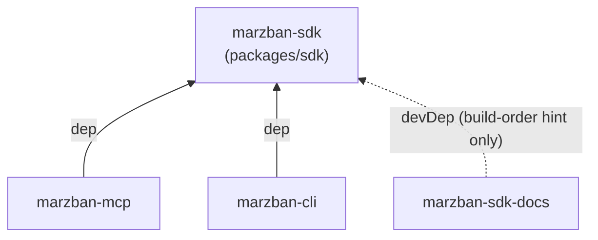

# Cross-package architecture

**Covers:** how the four packages depend on each other, the invariants that keep
that graph simple, known trade-offs.
**Excludes:** internals of any one package (see each package's own `ARCHITECTURE.md`).
**Next:** [`packages/sdk/ARCHITECTURE.md`](../packages/sdk/ARCHITECTURE.md) for the core.

## Dependency graph

One level, acyclic. `marzban-sdk` is the only package with no workspace
dependencies. `marzban-mcp` and `marzban-cli` depend on it via `workspace:^`.
`apps/docs` lists it under `devDependencies` — it never imports SDK code, that
entry exists purely so Turborepo builds the SDK before the docs site
(`build.dependsOn: ["^build"]`). `mcp`, `cli`, and `docs` do not depend on each
other.

## Invariants

- **All HTTP traffic to a Marzban panel goes through the SDK.** No package
  reaches for `axios`/`fetch`/`undici` directly — auth, retry, token refresh,
  and WebSocket handling exist in exactly one place.
- **The SDK's public surface is `packages/sdk/src/index.ts`.** Consumers import
  from `marzban-sdk`, never reach into `marzban-sdk/dist/*` or into `src/gen`
  internals.
- **Consumers can grow the SDK's public API, but only by widening the barrel.**
  When `marzban-mcp` needed logger types, error codes, or `redactSecrets`, those
  were added as named exports to `index.ts` — not read off SDK internals by
  duck-typing. The one exception (`HttpError.details` read via optional
  chaining in MCP's error mapper) is tracked as debt, not the pattern to copy.
- **No package depends on another consumer package.** If `mcp` and `cli` ever
  need to share logic, it belongs in the SDK, not in a new cross-dependency.

## Known trade-offs

- `packages/mcp/src/modules/users/users.helpers.ts` duplicates a couple of
  small domain helpers (`summarizeUser`, `buildRenewalPatch`) that should
  eventually move into the SDK — kept local for now rather than adding a
  premature abstraction.
- The MCP tool list is documented in three places by hand: the tool
  definitions in code, `packages/mcp/README.md`, and the docs site. Nothing
  checks they agree.
