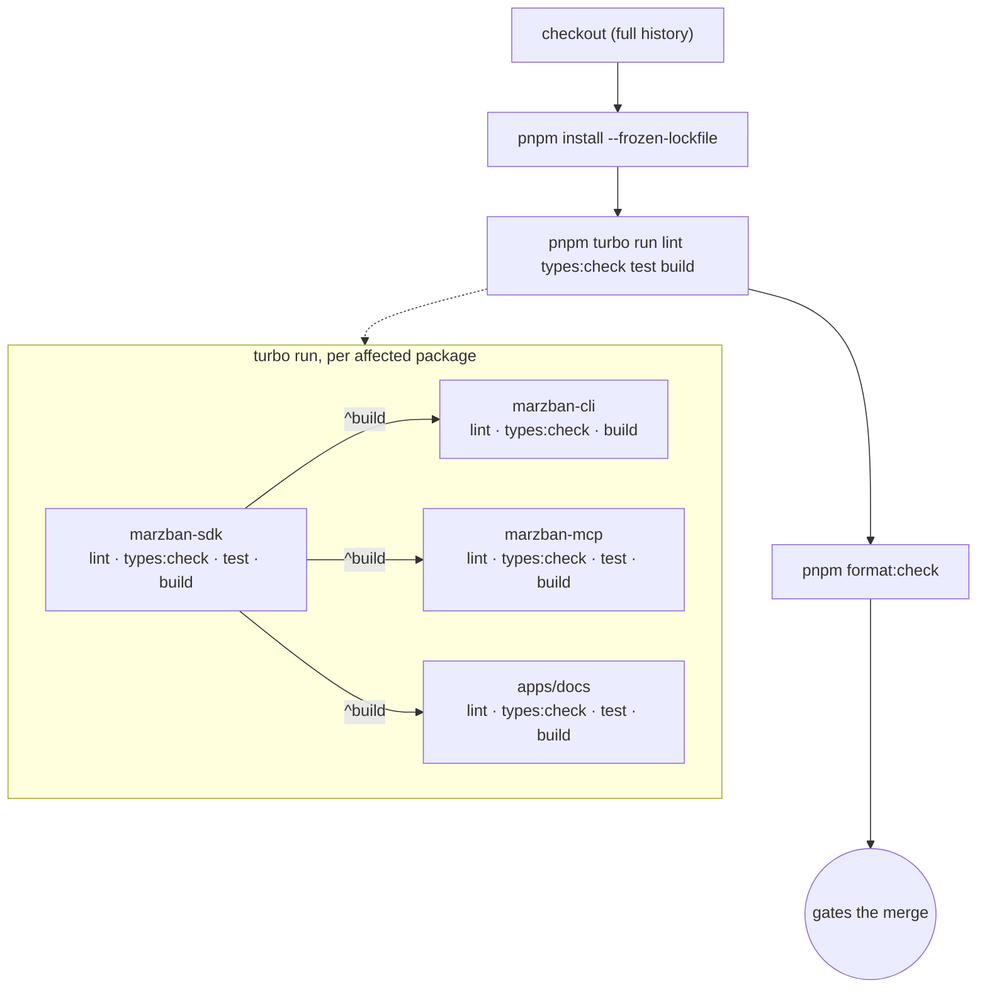

# CI

**Covers:** what `.github/workflows/ci.yml` checks and how to reproduce it locally.
**Excludes:** publishing and deployment (see [release.md](./release.md)).
**Next:** [release.md](./release.md).

## What runs

One job, Node 24, no matrix. Triggers on `pull_request` and `push` to `main`
and `dev`.

```
checkout (full history) → pnpm install --frozen-lockfile
  → pnpm turbo run lint types:check test build --filter="$TURBO_FILTER"
  → pnpm format:check
```

The single `turbo run` step is not one flat command — Turborepo fans it out
per affected package and orders `build` by the `^build` dependency graph
(`marzban-sdk` builds before anything that depends on it):



`TURBO_FILTER` scopes the run to what actually changed, so CI doesn't
rebuild the whole monorepo on every PR:

- On a PR: `...[origin/<base-branch>]` — everything changed since the branch
  point, plus anything that depends on it.
- On a push to `main`: `...[HEAD^1]` — everything changed in that push.

## What gates a merge

`lint`, `types:check`, `test` (which includes the coverage thresholds from
[testing.md](./testing.md)), `build`, and `format:check` all have to pass.

Every package defines its own `types:check` script (`tsc --noEmit`, or for
`apps/docs`: `fumadocs-mdx && next typegen && tsc --noEmit`). This matters
for `cli`/`mcp` specifically — they build with `tsup`'s `dts: false` (see
[workspace.md](./workspace.md)), so unlike `sdk` their `build` step alone
never ran a type check; `types:check` is what actually catches a type error
in those two packages.

## Reproducing locally

```sh
pnpm turbo run lint types:check test build
pnpm format:check
```

Scope to what you touched with `--filter` (see
[workspace.md](./workspace.md)) to match what CI would actually run on your PR.

## Integration workflow

`.github/workflows/integration.yml` is separate from `ci.yml` and does not
gate merges. It runs `sdk`'s and `mcp`'s `test:integration` suites (see
[testing.md](./testing.md) "Integration") against a real Marzban panel that
the workflow itself spins up in Docker on the runner — the same
`local/marzban/` stand used for manual testing, ephemeral for the run and
torn down afterward. No external hosting, no secrets: the panel never leaves
the runner and its credentials are the throwaway ones from
`local/marzban/.env.example`.

Triggers: `pull_request` targeting `main` or `dev` (default `opened` +
`synchronize` + `reopened` — reruns on every push to the PR branch, same as
`ci.yml`), `push` to `main` or `dev`, and `workflow_dispatch` (manual). Runs
on real change, not on a timer — no scheduled run that fires regardless of
whether anything changed.

Not a required check — `ci.yml` is what gates a merge (see "What gates a
merge" above); this workflow surfaces its result on the PR (and via
`push`/`workflow_dispatch`) without blocking it, since real network + Docker
startup makes it slower and less deterministic than the rest of CI. If you'd
rather it not rerun on every PR push, `pull_request.types` can be narrowed
to `[opened]`.
