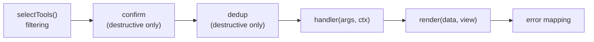

# `marzban-mcp` architecture

**Covers:** internal structure of `packages/mcp`, the tool pipeline, the
security model, how to add a tool, and how to run/test a source checkout
locally (Inspector, a bare `node` process, wiring a real client to your own
build).
**Excludes:** connecting a _published_ client (see `packages/mcp/README.md`
and the [docs site](https://ilmar7786.github.io/marzban-sdk) — those cover
`npx marzban-mcp`, not a repo checkout), SDK internals (see
[`packages/sdk/ARCHITECTURE.md`](../sdk/ARCHITECTURE.md)).
**Next:** [`docs/testing.md`](../../docs/testing.md) for the coverage rules that apply here.

## Purpose and boundary

An MCP server that exposes Marzban panel operations as tools for AI
assistants. Built entirely on `marzban-sdk` — it never talks HTTP directly
(see the invariant in [`docs/architecture.md`](../../docs/architecture.md)).
Its own job is: pick which SDK operations to expose, gate the dangerous ones,
and format responses to fit a model's context budget.

## Directory map

| Directory               | Role                                                                                         |
| ----------------------- | -------------------------------------------------------------------------------------------- |
| `src/index.ts`          | Binary entry point: load config, create the SDK client, create the server, serve over stdio. |
| `src/server.ts`         | `createMarzbanMcpServer()` — builds the `McpServer` instance, registers tools and prompts.   |
| `src/config/`           | Env-driven config schema, defaults, parsing.                                                 |
| `src/core/tool/`        | Tool definition helper, registry (filtering, wiring), request context.                       |
| `src/core/confirm/`     | Confirmation-token issuing and verification for destructive tools.                           |
| `src/core/idempotency/` | Remembers destructive calls so a repeat replays instead of running again.                    |
| `src/core/errors/`      | Maps SDK/tool errors to `CallToolResult`.                                                    |
| `src/core/logger.ts`    | stderr-only logger (see invariant below).                                                    |
| `src/format/`           | Renders tool output: `view` → `text`/`table`/`json` → truncation.                            |
| `src/modules/`          | Domain modules — one directory per area (users, config, nodes, system, subscription).        |
| `src/prompts/`          | Pre-built MCP prompts that sequence existing tools for common investigations.                |
| `src/shared/`           | Cross-module schemas and small utilities (pagination, duration parsing).                     |

## Server setup

Transport is **stdio only**, via `@modelcontextprotocol/server`. Capabilities
are `{ tools: {}, prompts: {} }` — resources are deliberately not registered.

**Invariant: stdout is reserved for JSON-RPC.** Every log line goes to
stderr (`core/logger.ts` writes via `process.stderr.write`, never
`console.log`). Anything that writes to stdout breaks the protocol.

## Tool call pipeline

Every registered tool runs through the same wrapper, defined once in
`core/tool/registry.ts`:



- **Filtering** happens once at startup: profile scope first
  (`readonly` → read-only tools, `standard` → +write, `full` → +destructive),
  then deny-globs (win over allow), then allow-globs, then a stable sort by
  name so `tools/list` output is deterministic (needed for prompt caching).
- **Annotations** (`readOnlyHint`, `destructiveHint`) are derived from each
  tool's `scope` — authors don't set them by hand.
- **Confirm** applies only to `destructive`-scoped tools, unless the tool's
  `skipConfirm(args)` returns true (used for dry-run previews). A token
  carries a TTL, a hash of the canonicalized arguments, and a per-process
  signing key; it's rejected on tool mismatch, argument mismatch, or reuse.
  `MARZBAN_MCP_CONFIRM` controls the mode: `off`, `auto` (confirm once per
  tool _and_ exact arguments, trusted for the same TTL as the token —
  `core/confirm/confirm.ts`'s `trustedCalls`), `always`.
- **Dedup** applies to the same calls confirmation does, in every confirm
  mode, and answers a different question: not "may this run?" but "has this
  already run?". `core/idempotency/` remembers each destructive call by the
  same `callKey` the trust cache uses, for five minutes; an identical repeat
  replays the recorded data with a notice instead of reaching the SDK, and a
  call whose outcome was never observed (an unsafe request that got no
  response) reports `unknown` and steers the model to verify state. A freshly
  verified token (`ConfirmDecision.reason === 'token'`) bypasses the record —
  see ADR-0019.
- **Handlers return plain data**, never a `CallToolResult` — rendering and
  error mapping are the pipeline's job, not the tool's.

## Config

Read only from environment variables — `config/env.ts` explicitly documents
that tool arguments must never carry credentials or `baseUrl`. The SDK client
is created once per process with `authenticateOnInit: false`, so the server
(and `tools/list`) comes up even if the panel is unreachable at startup.

## Local development & manual testing

Env vars are the only way in (see [Config](#config) above), and they're read
by **Node itself** (`node --env-file=.env`), not sourced into your shell or
typed into a UI — that's what makes every scenario below work off the same
one file with zero manual re-entry.

```sh
cd packages/mcp
cp .env.example .env
```

Defaults point at the disposable [local Marzban panel](../../local/marzban/README.md)
(`pnpm local:up` from the repo root) with `MARZBAN_MCP_PROFILE=full` — enough
to exercise destructive tools too. Its cert is self-signed with no SAN, which
is why `.env.example` also sets `NODE_TLS_REJECT_UNAUTHORIZED=0` — **delete
that line** the moment you point `MARZBAN_BASE_URL` at a real panel.

### Inspector, one command

```sh
pnpm --filter marzban-mcp inspect
```

Builds (via Turborepo, so `marzban-sdk` builds first if needed) and opens
[MCP Inspector](https://github.com/modelcontextprotocol/inspector) already
wired to your `.env` through [`inspector.config.json`](./inspector.config.json) —
nothing to type into the UI. From there, call any tool, inspect
`structuredContent`, and walk the confirm-token flow on a destructive tool.

For a scripted check without the UI, its `--cli` mode reads the same config:

```sh
npx -y @modelcontextprotocol/inspector@2.3.0 --cli \
  --config inspector.config.json --server marzban-local \
  --method tools/list
```

Each `--cli` invocation spawns a fresh `dist/index.js` process — fine for
stateless calls like `tools/list`, but the confirm-token signing key is
generated per-process on purpose (a restarted server must not honor a token
minted by a previous run, see `core/confirm/token.ts`), so a token from one
`--cli` call is **always** rejected by the next one. Testing the two-step
confirm flow on a destructive tool needs one continuous connection — use the
UI (`pnpm --filter marzban-mcp inspect`), not two `--cli` calls.

<details>
<summary>Why not pass <code>-e KEY=value</code> flags directly?</summary>

Two sharp edges, both easy to hit by hand: `-e` flags have to come _before_
the server command or the Inspector hands them to the server's `argv`
instead of using them itself, and the Inspector does not inherit your
shell's environment even when the flags are positioned correctly — so a
`source .env` beforehand silently does nothing. Routing everything through
`--env-file=.env` in `inspector.config.json` (see below) sidesteps both:
Node reads the file itself, and there's no env-related flag for the
Inspector to place wrong.

</details>

### A bare `node` process

Useful to confirm the server starts and authenticates before reaching for
the Inspector — config errors and logs go to stderr, per the stdout
invariant above:

```sh
pnpm turbo run build --filter=marzban-mcp
node --env-file=.env dist/index.js
```

It just sits there waiting for JSON-RPC on stdin; no output means it's up
and idle, not stuck.

### Pointing a real client at your local build

Same as any other [client setup](https://ilmar7786.github.io/marzban-sdk/docs/mcp-server/client-setup),
just swap `command`/`args` for a direct `node --env-file=... dist/index.js`
call instead of `npx -y marzban-mcp` — no `env` block needed in the client
config at all, since the `.env` file carries it:

```sh
claude mcp add marzban-local -- \
  node --env-file=/absolute/path/to/marzban-sdk/packages/mcp/.env \
       /absolute/path/to/marzban-sdk/packages/mcp/dist/index.js
```

Or the equivalent JSON for Claude Desktop / Cursor / VS Code:

```json
{
  "mcpServers": {
    "marzban-local": {
      "command": "node",
      "args": [
        "--env-file=/absolute/path/to/marzban-sdk/packages/mcp/.env",
        "/absolute/path/to/marzban-sdk/packages/mcp/dist/index.js"
      ]
    }
  }
}
```

Name it `marzban-local` (not `marzban`), so it's never ambiguous with a
real-panel entry in the same client config. Build first (`pnpm build` from
the repo root, or the scoped `pnpm turbo run build --filter=marzban-mcp` —
plain `pnpm --filter marzban-mcp build` skips Turborepo's dependency
ordering and fails if `marzban-sdk` hasn't been built yet, since
`dist/index.js` resolves it at runtime through the workspace symlink; see
[workspace.md](../../docs/workspace.md#turborepo)). Restart the client after
every rebuild, same as any other client-config change.

### Watch mode

`pnpm --filter marzban-mcp dev` runs `tsup --watch`, rebuilding
`dist/index.js` on save. There's nothing for it to hot-reload into, though —
stdio clients spawn a fresh process per connection — so the loop is: edit,
let it rebuild, then reconnect whatever's driving `dist/index.js` above
(the Inspector's reconnect, or a client restart).

Unit tests (`pnpm --filter marzban-mcp test`) mock the SDK — they don't
exercise the real stdio transport or a real panel. For that, and for the
coverage rules, see [`docs/testing.md`](../../docs/testing.md).

## `format/` — why it exists

Tool output is split into a domain-aware `view` (knows how to format bytes,
timestamps, etc. using SDK helpers) and a domain-blind renderer
(`text`/`table`/`json`, chosen by `MARZBAN_MCP_FORMAT`). The response carries
both `content` (compact, for the model) and `structuredContent` (full data).
Truncation (`MARZBAN_MCP_MAX_CHARS`) always cuts on a line boundary and adds
an explicit marker — a silent cut reads to the model as "this is everything."

## Extension points

To add a tool:

1. Add `xxxInputSchema`/`xxxOutputSchema` (Zod v4) to
   `modules/<area>/<area>.schemas.ts` — reuse SDK-exported schemas for
   structure where possible, but never for an `outputSchema`'s format claims:
   an SDK schema is written to _parse_ Marzban's response and can carry a
   JSON Schema `format` (e.g. `date-time`) the wire format doesn't actually
   guarantee — see ADR-0018. For a response containing a Marzban user, use
   `mcpUserResponseSchema`/`mcpSubscriptionUserResponseSchema` from
   `shared/schemas.ts` instead of `userResponseSchema`/
   `subscriptionUserResponseSchema` directly. `output-schema-regression.test.ts`
   fails on any tool whose `outputSchema` emits `format` at all, so this is
   enforced, not just documented. `outputSchema` must be a single object
   type. Destructive tools need a `confirmToken` field.
2. Add a `View<T>` to `modules/<area>/<area>.views.ts`.
3. Call `defineTool({...})` in `modules/<area>/<area>.tools.ts`. The tool
   name must start with `marzban_`.
4. Add the tool to the module's export array; a new module needs one more
   line in `src/modules/index.ts`.
5. Add tests — coverage is enforced at 100% (see
   [`docs/testing.md`](../../docs/testing.md)).

`server.ts` and `core/tool/registry.ts` need no changes — filtering,
annotations, confirmation, deduplication, rendering, and error mapping apply
automatically.

## Known trade-offs

- The tool list is documented by hand in three places (code, `README.md`,
  the docs site) with nothing checking they agree — see
  [`docs/architecture.md`](../../docs/architecture.md).
- `core/idempotency/classify.ts` can't tell "the connection was refused, so
  nothing was applied" from "an in-flight write timed out", because the
  transport-level error code has no public accessor on `HttpError`. It
  errs toward `unknown`, so an unreachable panel produces a needless "verify
  the state" answer for the length of the dedup window — see ADR-0019.
