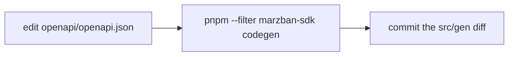

# `marzban-sdk` architecture

**Covers:** internal structure of `packages/sdk`, the generated-client workflow,
the public API barrier, how to extend it.
**Excludes:** how to use the SDK (see the [docs site](https://ilmar7786.github.io/marzban-sdk)),
cross-package concerns (see [`docs/architecture.md`](../../docs/architecture.md)).
**Next:** [`docs/testing.md`](../../docs/testing.md) for the coverage rules that apply here.

## Purpose and boundary

The typed Marzban API client. Owns everything infrastructural an integration
needs: HTTP transport, auth/token refresh, retries, WebSocket log streaming,
webhook verification, config validation, error classification, secret
redaction. Every other package in this repo consumes it and adds nothing of
its own on top of HTTP.

## Directory map

| Directory      | Role                                                                                                                        |
| -------------- | --------------------------------------------------------------------------------------------------------------------------- |
| `src/index.ts` | The only public entry point.                                                                                                |
| `src/core/`    | Hand-written infrastructure: `MarzbanSDK.ts` (the facade) plus `auth/`, `http/`, `errors/`, `logger/`, `webhook/`, `ws/`.   |
| `src/config/`  | Zod config schema, defaults, validation.                                                                                    |
| `src/common/`  | Runtime-agnostic utilities with no domain knowledge (redaction, byte/buffer helpers, event emitter, environment detection). |
| `src/gen/`     | Fully generated from OpenAPI via kubb — `api/`, `models/`, `schemas/`. Committed to git, never hand-edited.                 |
| `src/helpers/` | Convenience utilities for SDK consumers (bytes, datetime, pagination) — not used by `core/`.                                |

Dependency direction is one-way and acyclic: `index.ts → core/MarzbanSDK.ts →
{config, core/*, gen/api}`. `common/` sits below everything and depends on
nothing else in the package. `helpers/` is isolated on purpose — it's for
consumers, not for `core/`.

## Public API barrier

Two strategies, applied deliberately per module:

- **Named exports** where the source module also holds internals that
  shouldn't leak — e.g. from `common/` only `errorText` and `redactSecrets`
  are exported; from `config/` only `Config`, `validateConfig`, and
  `ValidatedConfig`. `MarzbanSDK` itself is exported **as a type only** —
  instantiation goes exclusively through `createMarzbanSDK()`.
- **Blanket re-export** for modules that are public in full: `core/errors`,
  `core/webhook`, `core/ws`, `helpers`, `gen/models`, `gen/schemas`.
- `export type * from './gen/api'` — the generated `*Api` classes are
  available as types (so consumers can type a variable as `NodeApi`, etc.)
  but can't be instantiated directly. The only way to get one is
  `sdk.node`, `sdk.user`, and so on.

When a consumer package needs something new from the SDK, widen the barrier
with a named export — don't have the consumer reach past it.

## Request flow

1. `createMarzbanSDK(config)` validates config (`config/validate.ts`), builds
   a logger, an `AuthManager`, and calls `configureHttpClient()`, which
   creates **two separate axios instances**: `client` (auth interceptors
   attached) and `publicClient` (none, used only for login). Two instances
   exist because early versions shared one global client across SDK
   instances — see [ADR-0004](../../docs/adr/0004-classed-generated-api-clients.md).
2. Every generated `*Api` class receives `client` through its constructor and
   is assigned to a facade field by hand in `MarzbanSDK.ts` (e.g.
   `this.node = new nodeApi({ client: http.client })`) — this wiring is the
   one place per module that isn't generated.
3. `axios-retry` is installed on both instances _before_ the auth
   interceptors — it needs the raw `AxiosError`, which auth wraps into
   `HttpError`. Each instance gets its own `retryCondition`: `client` retries
   only GET/HEAD/OPTIONS, `publicClient` (login) also retries POST. Request
   interceptor then waits for any in-flight auth (`authService.waitForCurrentAuth()`)
   and attaches `Authorization`; response interceptor retries once on `401`
   after a re-login.
4. Every error is wrapped into `SdkError` (or a subclass) **before** it
   reaches the logger — `redactSecrets()` runs inside the `SdkError`
   constructor and again in the default logger, so a raw `AxiosError`
   carrying credentials never reaches a user-supplied logger.

## Config

`Config` (what a consumer passes in, via `z.input<...>`) and `ValidatedConfig`
(defaults applied, via `z.infer<...>`) are distinct types — only
`ValidatedConfig` circulates inside `core/`. Validation runs twice
(`createMarzbanSDK` and again in the `MarzbanSDK` constructor) so that calling
`new MarzbanSDK(config)` directly is just as safe as the factory — this is
intentional, not redundant.

## Generated client workflow

Source of truth: `packages/sdk/openapi/openapi.json`, vendored and manually
patched where the upstream spec is imprecise (see
[ADR-0003](../../docs/adr/0003-vendored-openapi-spec.md)). Generator: kubb
(`kubb.config.ts`), driven by `pnpm --filter marzban-sdk codegen`.

`clean: true` means every codegen run replaces `src/gen` entirely — hand
edits there are pointless and will be silently discarded. If generated
output is wrong, fix the spec (or, for structural output shape, the kubb
config), never the generated file.

`src/gen-regression.test.ts` pins a specific failure mode: kubb emits
`z.object({})` for spec objects with no declared `properties`, and Zod's
strip mode silently drops every key on parse. Left unchecked, a future
`codegen` run against an imprecise upstream spec would make
`getCoreConfig()`/`modifyCoreConfig()` and `proxies` fields quietly return
`{}`. The test exists so that regression is caught at test time, not in
production.

## Errors

`SdkError<T>` is the base; `ERROR_CODES` is a fixed const map (`CONFIG_INVALID`,
`NETWORK_HTTP_ERROR`, `AUTH_FAILED`, …). Categories (`HttpError`, `AuthError`,
`ConfigurationError`, three `Webhook*Error` variants) extend it. Type guards
(`isHttpError`, `isAuthError`, …) are the supported way to narrow — don't
match on `error.code` strings or `instanceof` on internals.

## Extension points

- **Add a method to an existing module:** edit the OpenAPI spec, run
  `codegen`, commit the diff. No hand-written code involved.
- **Add a new module (new OpenAPI tag):** edit the spec, run `codegen` (kubb
  creates `src/gen/api/{Tag}Api/`), then add one field to `MarzbanSDK.ts` —
  the `readonly x: xApi` declaration and `this.x = new xApi({ client })` in
  the constructor. This is the only manual step; type exports follow
  automatically through `export type * from './gen/api'`.
- **Add hand-written infrastructure** (a new `core/` subsystem): keep it
  behind the same two-tier export strategy above — internals stay
  unexported until a consumer actually needs them.

## Trade-offs

- Coverage thresholds are 100% for hand-written code; `src/gen/**` is
  excluded on purpose — testing it would test the generator, not this
  package. See [`docs/testing.md`](../../docs/testing.md).
- No project references between this package and its consumers — workspace
  linking plus Turborepo's `^build` is considered sufficient. See
  [`docs/workspace.md`](../../docs/workspace.md).
